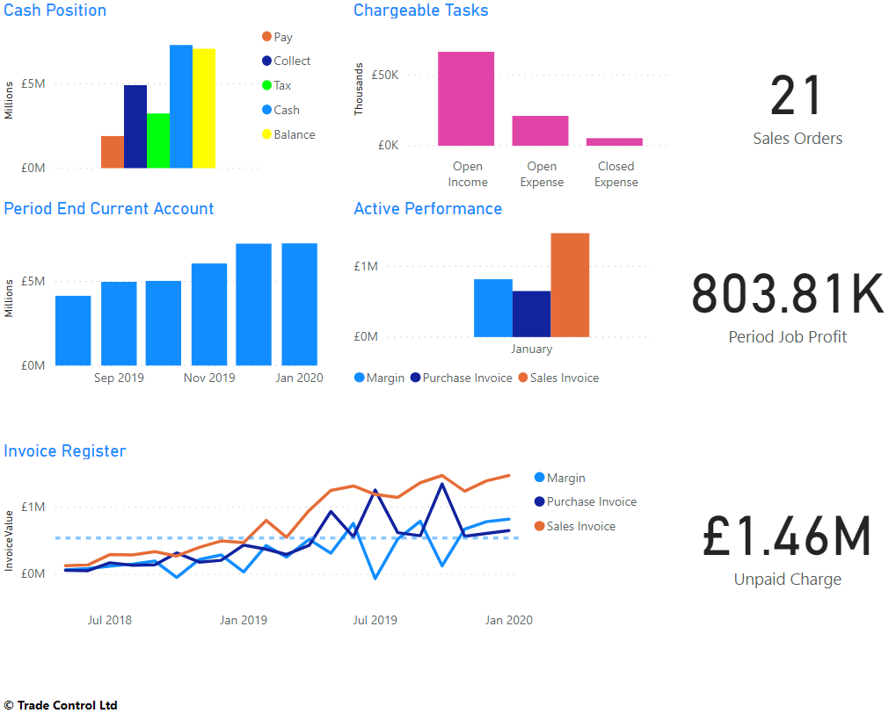
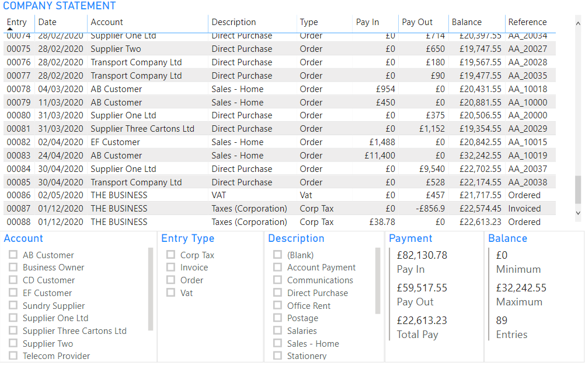
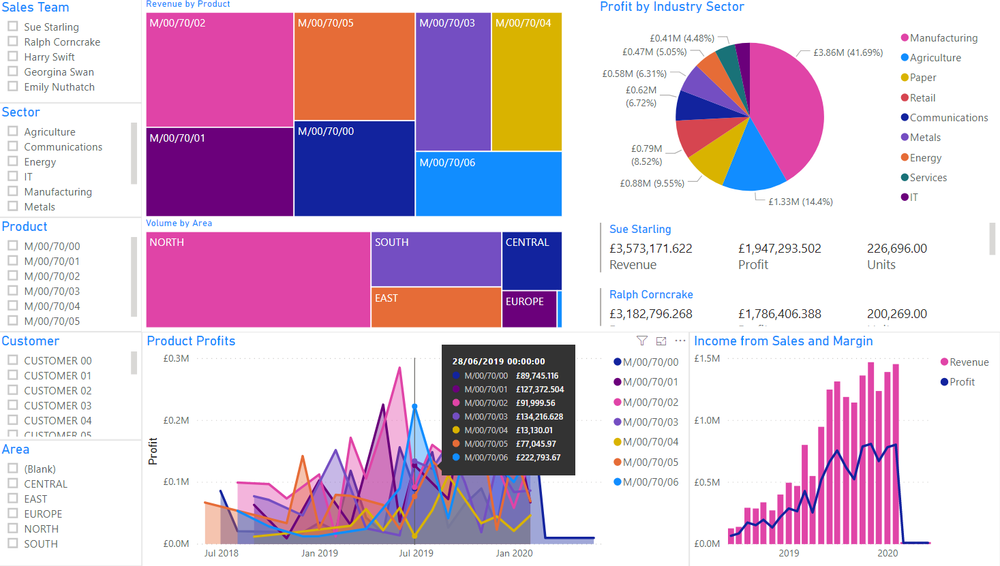
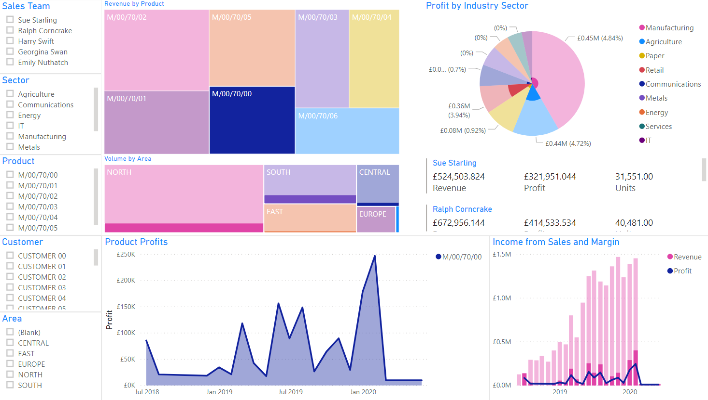

# Trade Control - Power BI

Reporting services for the [Trade Control](https://github.com/tradecontrol/tc-nodecore) management information system.

## Overview

The Power BI template for Trade Control presents users with Business Intelligence data. It communicates several useful indicators and provides a basis for further development and customisation. Once published to the BI Service, users can interact with the information by creating their own dashboards and workspaces on tablets and mobile phones.

The template also works with [bitcoin as unit of account](https://github.com/tradecontrol/tc-bitcoin).

## Template

The template has separate pages for finance, statements and sales analysis. 

> **NOTE**
> 
> The information presented in the following screenshots is [fictitious](#sample). 


### Finance

The underlying data for this page is taken from unaggregated Sql Server views, also presented in the [Office 365 interface](https://github.com/tradecontrol/tc-office).

Trade Control calculates the tax burden with transaction grained frequency. Because it also reconciles to cash accounts that can mirror money in the bank, it is possible to report on the real-time financial health of the business.



Each task is a structured project, so profitability can be established at any level.  Job profit is calculated for top-level orders by recursing over the structure and deducting costs from the total charge. 

### Statements

Power BI can present data grids to the user. The Company Statement is a transaction-grained forward projection of income, expenditure, expenses and tax, beginning with the balance of the trading cash account. As work is scheduled and accruals entered, that balance is constantly being revised. It is therefore an aid in scheduling workloads so that the business is able to remain profitable in the future.

The template allows you to splice the statement by account, entry type and cash code. This means you can examine, in one statement, the company position for the sales and purchasing order books, invoices, expenses, accruals, taxes and cash classifications.



### Sales Analysis

This page reflects your standard approach to BI reporting. There is no end to the amount of Sales Analysis you can do, but here we show how Trade Control can be used to generate the sort of stuff sales teams like to see - volume, income and profit by various criteria such as product, customer, sales rep, region and industry type.



You can click on any of the selection lists to splice the data, but you can also interact with the graphs. The screenshot below shows how selecting the M/00/70/00 product in the Revenue by Product Tree Map impacts the other visualisations.



## Template Installation

Power BI is Microsoft's environment for publishing important analytical data to mobile phones, tablets and websites. It consists of three elements: Desktop to code the reports, Services to consume and distribute them, and Mobile.

Import [the template](src/tradecontrol.pbit) into Power BI Desktop and set the data source to your instance of Azure SQL. The template has been written for compatibility with all installations 3.27.1 or higher. 

Follow the online instructions for publishing to the Power BI Service.

## Data

After opening the [Trade Control PowerBI template](src/tradecontrol.pbit) you can create a PowerBI file for your own business. Select **Edit Queries/Data source Settings** to switch between different installations. 

On the side bar of the BI Desktop are three views for reporting, data and the model. The model uses DirectQuery to connect SQL Server views. These views are not coded specifically for reporting purposes, so they are hidden from the user by abstracting the relevant data into DAX tables. The relations between these tables determine how the data is spliced by the BI interface. They can be amended in the Model. Another reason for using DAX is that data from DirectQuery is inaccessible to the user, but the Data view has access to unaggregated rows in a DAX table.

## Sample

The richness of Business Intelligence reporting depends upon large datasets, built up over time from the volume of transactions. When you start out with a new business, or install an MIS for the first time, there is no data to speak of, so all your visualisations are blank. However, you can create a fictitious dataset from the code in this repository and replicate the visualisations shown. The template can then be customised to suit your own purposes when switching to a live data source. 
 
### Installation

First, install Trade Control onto an Azure SQL instance and [configure a basic setup](https://github.com/TradeControl/tc-nodecore/blob/master/docs/tc_nodecore_config.md#basic-setup). There are then two ways to generate the data:

- Open [the script](src/TestData/tc_bom_demo_extension.sql) in SSMS and execute directly
- From Visual Studio, open the TestData.sqlproj and execute from inside the IDE

A different result set is generated each time the script is executed on the same instance. That is because areas, products and sectors are randomly applied to both customers and the sales team using the ```RAND()``` function. The amount of data generated can be altered by adding additional historical financial years in the [Administration form](https://github.com/tradecontrol/tc-office), setting the status to Closed; and by modifying the ```@MaxCustomers smallint = 20``` declaration at the top of the script.

### Script

The sample data builds on the [Bill of Materials demo](https://github.com/tradecontrol/tc-office/blob/master/docs/tc_demo_manufacturing.md). The script implements the additional operations:

1. Create six new products by making M/00/70/00 in six different colours, altering the plastic material to change the costs. Arbitrarily alter selling prices to generate different gross profit margins.
2. Add five new users without administrative rights to represent the Sales Team
3. Declare in-memory tables of area and sector codes for random assignment to new customers
4. Assign the BOM Demo sales order to a member of the Sales Team and assign sector and area codes to the existing customer account
5. Create the new customers and their orders, each time exploding the BOM and scheduling the associated orders.
6. Specify suppliers for the new purchase orders
7. Recurse through the order book and invoice all historical sales and purchases
8. Pay invoices where ```ExpectedOn < EOMONTH(DATEADD(MONTH, -1,CURRENT_TIMESTAMP))```
9. Pay the outstanding VAT and corporation tax

## Licence

The Trade Control Code licence is issued by Trade Control Ltd under a [GNU General Public Licence v3.0](https://www.gnu.org/licenses/gpl-3.0.en.html) 

Trade Control Documentation by Trade Control Ltd is licenced under a [Creative Commons Attribution-ShareAlike 4.0 International License](http://creativecommons.org/licenses/by-sa/4.0/) 

 


